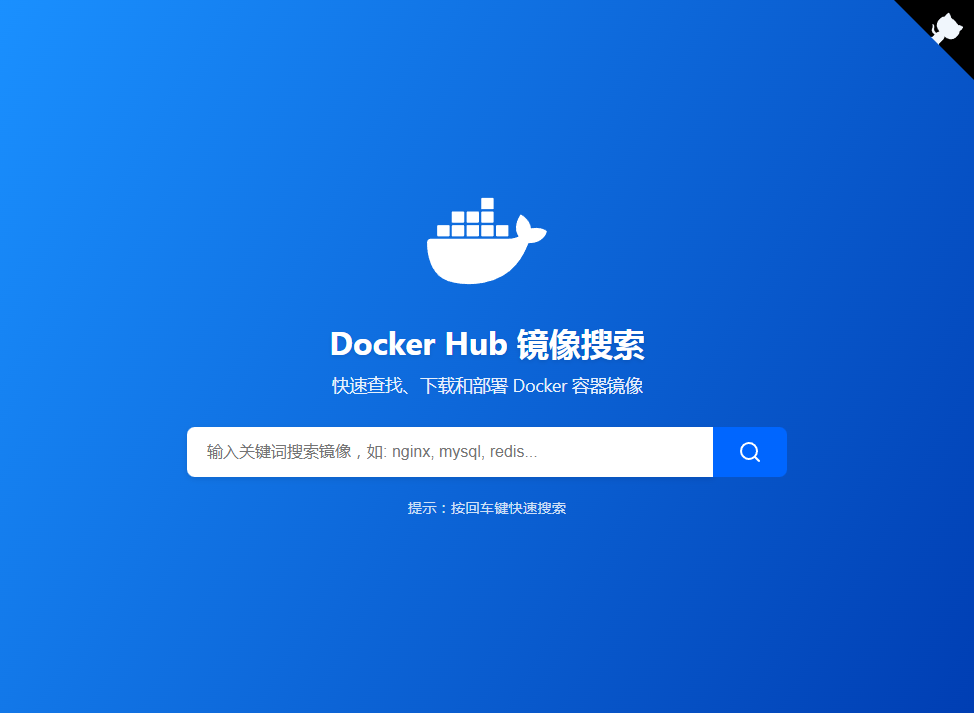

[**第三方 DockerHub 镜像服务列表**](https://github.com/cmliu/CF-Workers-docker.io?tab=readme-ov-file#%E7%AC%AC%E4%B8%89%E6%96%B9-dockerhub-%E9%95%9C%E5%83%8F%E6%9C%8D%E5%8A%A1)



# 🐳 CF-Workers-docker.io：Docker仓库镜像代理工具

这个项目是一个基于 Cloudflare Workers 的 Docker 镜像代理工具。它能够中转对 Docker 官方镜像仓库的请求，解决一些访问限制和加速访问的问题。

> [!CAUTION]
> **docker.cmliussss.net 已被GFW污染，需自行部署使用。**

> [!WARNING]
> 根据 [Cloudflare 协议](https://www.cloudflare.com/zh-cn/terms/) 中，2.2.1 第 (j) use the Services to provide a virtual private network or other similar proxy services.
>
> 使用本服务可能存在被 Cloudflare 封号的潜在风险，请自行斟酌使用风险。

## 🚀 部署方式

- **Workers** 部署：复制 [_worker.js](https://github.com/cmliu/CF-Workers-docker.io/blob/main/_worker.js) 代码，`保存并部署`即可
- **Pages** 部署：`Fork` 后 `连接GitHub` 一键部署即可

## ⚙️ 如何使用？ [视频教程](https://www.youtube.com/watch?v=l2jwq9CagNQ)

例如您的Workers项目域名为：`docker.cmliussss.net`；

### 1.官方镜像路径前面加域名

```shell
docker pull docker.cmliussss.net/stilleshan/frpc:latest
```

```shell
docker pull docker.cmliussss.net/library/nginx:stable-alpine3.19-perl
```

### 2.一键设置镜像加速

修改文件 `/etc/docker/daemon.json`（如果不存在则创建）

```shell
sudo mkdir -p /etc/docker
sudo tee /etc/docker/daemon.json <<-'EOF'
{
  "registry-mirrors": ["https://docker.cmliussss.net"]  # 请替换为您自己的Worker自定义域名
}
EOF
sudo systemctl daemon-reload
sudo systemctl restart docker
```

### 3. 配置常见仓库的镜像加速

#### 3.1 配置

`Containerd` 较简单，它支持任意 `registry` 的 `mirror`，只需要修改配置文件 `/etc/containerd/config.toml`，添加如下的配置：

```yaml
    [plugins."io.containerd.grpc.v1.cri".registry]
      [plugins."io.containerd.grpc.v1.cri".registry.mirrors]
        [plugins."io.containerd.grpc.v1.cri".registry.mirrors."docker.io"]
          endpoint = ["https://xxxx.xx.com"]
        [plugins."io.containerd.grpc.v1.cri".registry.mirrors."registry.k8s.io"]
          endpoint = ["https://xxxx.xx.com"]
        [plugins."io.containerd.grpc.v1.cri".registry.mirrors."k8s.gcr.io"]
          endpoint = ["https://xxxx.xx.com"]
        [plugins."io.containerd.grpc.v1.cri".registry.mirrors."gcr.io"]
          endpoint = ["https://xxxx.xx.com"]
        [plugins."io.containerd.grpc.v1.cri".registry.mirrors."ghcr.io"]
          endpoint = ["https://xxxx.xx.com"]
        [plugins."io.containerd.grpc.v1.cri".registry.mirrors."quay.io"]
          endpoint = ["https://xxxx.xx.com"]
```

`Podman` 同样支持任意 `registry` 的 `mirror`，修改配置文件 `/etc/containers/registries.conf`，添加配置：

```yaml
unqualified-search-registries = ['docker.io', 'k8s.gcr.io', 'gcr.io', 'ghcr.io', 'quay.io']

[[registry]]
prefix = "docker.io"
insecure = true
location = "registry-1.docker.io"

[[registry.mirror]]
location = "xxxx.xx.com"

[[registry]]
prefix = "registry.k8s.io"
insecure = true
location = "registry.k8s.io"

[[registry.mirror]]
location = "xxxx.xx.com"

[[registry]]
prefix = "k8s.gcr.io"
insecure = true
location = "k8s.gcr.io"

[[registry.mirror]]
location = "xxxx.xx.com"

[[registry]]
prefix = "gcr.io"
insecure = true
location = "gcr.io"

[[registry.mirror]]
location = "xxxx.xx.com"

[[registry]]
prefix = "ghcr.io"
insecure = true
location = "ghcr.io"

[[registry.mirror]]
location = "xxxx.xx.com"

[[registry]]
prefix = "quay.io"
insecure = true
location = "quay.io"

[[registry.mirror]]
location = "xxxx.xx.com"

```

#### 3.3 使用

对于以上配置，k8s 在使用的时候，就可以直接 `pull` 外部无法 pull 的镜像了。

```shell
# 手动可以直接pull配置了mirror的仓库
crictl pull registry.k8s.io/kube-proxy:v1.28.4
docker  pull nginx:1.21
```

## 🔧 变量说明

| 变量名 | 示例 | 必填 | 备注 |
|--|--|--|--|
| URL302 | `https://t.me/CMLiussss` |❌| 主页302跳转 |
| URL | `https://www.baidu.com/` |❌| 主页伪装(设为`nginx`则伪装为nginx默认页面) |
| UA | `netcraft` |❌| 支持多元素, 元素之间使用空格或换行作间隔 |

# 🛠️ 第三方 DockerHub 镜像服务

**注意:**

- 以下内容仅做镜像服务的整理与搜集，未做任何安全性检测和验证。
- 使用前请自行斟酌，并根据实际需求进行必要的安全审查。
- 本列表中的任何服务都不做任何形式的安全承诺或保证。

| DockerHub 镜像仓库 | 镜像加地址 |
| ------------------ | ----------- |
| [bestcfipas镜像服务](https://t.me/bestcfipas/1900) | `https://docker.registry.cyou` |
|  | `https://docker-cf.registry.cyou` |
| [zero_free镜像服务](https://t.me/zero_free/80) | `https://docker.jsdelivr.fyi` |
|  | `https://dockercf.jsdelivr.fyi` |
|  | `https://dockertest.jsdelivr.fyi` |
| [docker proxy](https://dockerpull.com/) | `https://dockerpull.com` |
| [docker proxy](https://dockerproxy.cn/) | `https://dockerproxy.cn` |
| [Docker镜像加速站](https://hub.uuuadc.top/) | `https://hub.uuuadc.top` |
|  | `https://docker.1panel.live` |
|  | `https://hub.rat.dev` |
| [DockerHub 镜像加速代理](https://docker.anyhub.us.kg/) | `https://docker.anyhub.us.kg` |
|  | `https://docker.chenby.cn` |
|  | `https://dockerhub.jobcher.com` |
| [镜像使用说明](https://dockerhub.icu/) | `https://dockerhub.icu` |
| [Docker镜像加速站](https://docker.ckyl.me/) | `https://docker.ckyl.me` |
| [镜像使用说明](https://docker.awsl9527.cn/) | `https://docker.awsl9527.cn` |
| [镜像使用说明](https://docker.hpcloud.cloud/) | `https://docker.hpcloud.cloud` |
| [DaoCloud 镜像站](https://github.com/DaoCloud/public-image-mirror) | `https://docker.m.daocloud.io` |
| [AtomHub 可信镜像仓库平台](https://atomhub.openatom.cn/) (只包含基础镜像，共336个) | `https://atomhub.openatom.cn` |

# 🙏 鸣谢

[muzihuaner](https://github.com/muzihuaner)、[V2ex网友](https://global.v2ex.com/t/1007922)、[ciiiii](https://github.com/ciiiii/cloudflare-docker-proxy)、[ChatGPT](https://chatgpt.com/)、[白嫖哥](https://t.me/bestcfipas/1900)、[zero_free频道](https://t.me/zero_free/80)、[dongyubin](https://github.com/cmliu/CF-Workers-docker.io/issues/8)、[kiko923](https://github.com/cmliu/CF-Workers-docker.io/issues/5)
